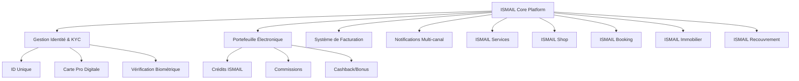

# Analyse des Besoins Métier - Plateforme ISMAIL

## 1. CARTOGRAPHIE DES MODULES ET INTERACTIONS

### 1.1 Vue d'Ensemble des Modules



### 1.2 Matrice d'Interactions Inter-Modules

| Module Source | Module Cible | Type d'Interaction | Données Échangées |
|---------------|--------------|-------------------|-------------------|
| Services | Portefeuille | Débit crédits | Montant, ID transaction |
| Shop | Portefeuille | Débit crédits | Montant, ID commande |
| Booking | Portefeuille | Débit crédits | Montant, ID réservation |
| Immobilier | Recouvrement | Créance locative | Montant loyer, échéance |
| Tous modules | Facturation | Génération facture | Détails transaction |
| Tous modules | Notifications | Alertes/Confirmations | Événements métier |

## 2. PERSONAS DÉTAILLÉS

### 2.1 Persona : Hyper Admin (Mamadou - DSI)
- **Âge** : 45 ans
- **Rôle** : Directeur Système Information
- **Objectifs** : Sécurité maximale, performance, conformité
- **Frustrations** : Complexité technique, risques sécurité
- **Besoins** :
  - Dashboard technique complet
  - Logs et audit en temps réel
  - Contrôle total des accès
  - Monitoring infrastructure

### 2.2 Persona : Commercial Manager (Aïcha - Responsable Commerciale)
- **Âge** : 32 ans
- **Rôle** : Gestionnaire portefeuille partenaires
- **Objectifs** : Maximiser commissions, fidéliser partenaires
- **Frustrations** : Suivi manuel, calculs complexes
- **Besoins** :
  - Dashboard commissions temps réel
  - Outils de suivi partenaires
  - Reporting automatisé
  - Communication facilitée

### 2.3 Persona : Partenaire Prestataire (Kofi - Plombier)
- **Âge** : 38 ans
- **Rôle** : Artisan indépendant
- **Objectifs** : Plus de clients, paiements rapides
- **Frustrations** : Visibilité limitée, retards paiement
- **Besoins** :
  - Profil attractif
  - Calendrier simple
  - Paiements instantanés
  - Communication client

### 2.4 Persona : Client Final (Fatou - Cadre)
- **Âge** : 29 ans
- **Rôle** : Professionnelle urbaine
- **Objectifs** : Services rapides, fiables, sécurisés
- **Frustrations** : Recherche fastidieuse, qualité incertaine
- **Besoins** :
  - Recherche intuitive
  - Évaluations fiables
  - Paiement sécurisé
  - Suivi en temps réel

## 3. RÈGLES MÉTIER SPÉCIFIQUES

### 3.1 Système de Crédits
- **Conversion** : 1 crédit = 50 FCFA (paramétrable par région)
- **Minimum achat** : 100 crédits (5,000 FCFA)
- **Expiration** : 12 mois d'inactivité
- **Transfert** : Maximum 20% du solde par mois entre comptes liés

### 3.2 Commissions Commerciales
```
Niveau Commercial | Taux Commission | Conditions
Junior            | 4%             | 0-10 partenaires actifs
Senior            | 6%             | >10 partenaires actifs
Chef d'équipe     | +2%            | Sur équipe (max 5 commerciaux)
```

### 3.3 Système d'Évaluation
- **Échelle** : 1-5 étoiles
- **Minimum requis** : 4.0/5 pour maintien listing
- **Période probatoire** : 3 mois pour nouveaux partenaires
- **Suspension automatique** : <3.5/5 sur 10 évaluations consécutives

### 3.4 Gestion des Litiges
- **Délai réclamation** : 48h après prestation
- **Médiation automatique** : Système de chat intégré
- **Escalade** : Admin si non résolu en 72h
- **Remboursement** : Automatique si faute partenaire avérée

## 4. FLUX DE DONNÉES CRITIQUES

### 4.1 Flux d'Inscription Utilisateur
```
1. Saisie informations personnelles
2. Upload documents identité
3. Capture biométrique (empreinte + photo)
4. Validation KYC automatique
5. Génération ID unique
6. Création carte professionnelle
7. Activation compte
8. Notification confirmation
```

### 4.2 Flux de Transaction Standard
```
1. Sélection service/produit
2. Vérification solde crédits
3. Réservation temporaire crédits
4. Confirmation transaction
5. Débit définitif
6. Notification partenaire
7. Calcul commission commercial
8. Génération facture
9. Archivage transaction
```

### 4.3 Flux de Recouvrement Automatique
```
1. Détection échéance dépassée
2. Vérification règles de relance
3. Génération message personnalisé
4. Envoi notification multi-canal
5. Enregistrement action
6. Planification relance suivante
7. Escalade si seuils atteints
```

## 5. EXIGENCES TECHNIQUES MÉTIER

### 5.1 Performance
- **Temps de réponse** : <2s pour 95% des requêtes
- **Disponibilité** : 99.9% (8h downtime/an max)
- **Concurrent users** : 10,000 simultanés (phase 1)
- **Scalabilité** : x10 en 6 mois

### 5.2 Sécurité
- **Chiffrement** : AES-256 au repos, TLS 1.3 en transit
- **Authentification** : MFA obligatoire pour admins/commerciaux
- **Audit** : Logs complets 5 ans minimum
- **Conformité** : RGPD + UEMOA + ISO 27001

### 5.3 Intégrations Requises
- **Mobile Money** : Orange Money, MTN Money, Moov Money
- **Banques** : API Open Banking principales banques CEDEAO
- **Fiscal** : DGID Côte d'Ivoire, autres administrations UEMOA
- **Géolocalisation** : Google Maps, OpenStreetMap
- **Communication** : SMS (Nexmo), Email (SendGrid), Push (Firebase)

## 6. CONTRAINTES ET LIMITATIONS

### 6.1 Contraintes Réglementaires
- **KYC** : Vérification obligatoire sous 24h
- **AML** : Déclaration transactions >1M FCFA
- **Données** : Localisation obligatoire en Afrique
- **Fiscal** : Déclaration automatique selon seuils pays

### 6.2 Contraintes Techniques
- **Offline** : Fonctionnement dégradé sans internet
- **Bandwidth** : Optimisation pour connexions lentes
- **Devices** : Support Android 7+ et iOS 12+
- **Languages** : Français, Anglais, langues locales

### 6.3 Contraintes Business
- **Onboarding** : <5 minutes pour client standard
- **Support** : Réponse <2h en heures ouvrables
- **Paiements** : Instantanés pour montants <100K FCFA
- **Commissions** : Versement mensuel automatique

## 7. MÉTRIQUES DE SUCCÈS

### 7.1 KPIs Techniques
- **Uptime** : >99.9%
- **Response time** : <2s moyenne
- **Error rate** : <0.1%
- **Security incidents** : 0 critique

### 7.2 KPIs Business
- **User adoption** : 10K utilisateurs actifs/mois (6 mois)
- **Transaction volume** : 1M FCFA/jour (3 mois)
- **Partner satisfaction** : >4.5/5
- **Revenue per user** : 5,000 FCFA/mois

### 7.3 KPIs Opérationnels
- **Support tickets** : <5% du volume transactions
- **Resolution time** : <24h moyenne
- **Churn rate** : <5% mensuel
- **Commission accuracy** : 100%

## 8. ROADMAP FONCTIONNELLE

### 8.1 MVP (Mois 1-6)
- Authentification et KYC
- Portefeuille de base
- Module Services simplifié
- Paiements mobile money

### 8.2 Version 1.0 (Mois 7-12)
- Tous les 5 modules
- Commissions automatiques
- Applications mobiles
- Intégrations bancaires

### 8.3 Version 2.0 (Mois 13-18)
- Intelligence artificielle
- IoT préparation
- Expansion régionale
- Analytics avancés

## PROCHAINES ÉTAPES

1. **Validation stakeholders** : Présentation analyse aux parties prenantes
2. **Spécifications techniques** : Traduction en exigences techniques
3. **Architecture système** : Conception architecture détaillée
4. **Prototypage** : Création prototypes interactifs

---

**Statut** : ✅ Analyse complétée
**Prochaine étape** : Architecture Système
**Responsable** : Équipe Architecture
**Échéance** : Semaine 5
