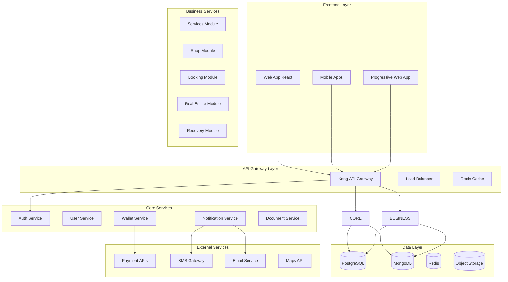

# Architecture Technique - Plateforme ISMAIL

## 1. ARCHITECTURE GLOBALE

### 1.1 Vue d'Ensemble Microservices



### 1.2 Principes Architecturaux

#### Design Patterns
- **Microservices** : Services autonomes et déployables indépendamment
- **API-First** : Toutes les fonctionnalités exposées via APIs REST
- **Event-Driven** : Communication asynchrone via événements
- **CQRS** : Séparation lecture/écriture pour performance
- **Saga Pattern** : Gestion transactions distribuées

#### Qualités Systémiques
- **Scalabilité** : Horizontale via Kubernetes
- **Résilience** : Circuit breakers, retry, timeout
- **Observabilité** : Logs, métriques, tracing distribué
- **Sécurité** : Zero-trust, chiffrement bout-en-bout

## 2. COUCHE INFRASTRUCTURE

### 2.1 Orchestration Kubernetes

```yaml
# Exemple de déploiement service
apiVersion: apps/v1
kind: Deployment
metadata:
  name: auth-service
spec:
  replicas: 3
  selector:
    matchLabels:
      app: auth-service
  template:
    metadata:
      labels:
        app: auth-service
    spec:
      containers:
      - name: auth-service
        image: ismail/auth-service:latest
        ports:
        - containerPort: 8080
        env:
        - name: DB_HOST
          valueFrom:
            secretKeyRef:
              name: db-secret
              key: host
        resources:
          requests:
            memory: "256Mi"
            cpu: "250m"
          limits:
            memory: "512Mi"
            cpu: "500m"
```

### 2.2 Configuration Infrastructure

#### Environnements
```
Development:
  - 1 cluster Kubernetes (3 nodes)
  - Bases de données partagées
  - Monitoring basique

Staging:
  - 1 cluster Kubernetes (5 nodes)
  - Réplication bases de données
  - Tests de charge

Production:
  - 2 clusters Kubernetes (10 nodes chacun)
  - Haute disponibilité multi-zone
  - Monitoring complet + alerting
```

#### Auto-scaling
```yaml
apiVersion: autoscaling/v2
kind: HorizontalPodAutoscaler
metadata:
  name: auth-service-hpa
spec:
  scaleTargetRef:
    apiVersion: apps/v1
    kind: Deployment
    name: auth-service
  minReplicas: 2
  maxReplicas: 10
  metrics:
  - type: Resource
    resource:
      name: cpu
      target:
        type: Utilization
        averageUtilization: 70
```

## 3. SERVICES CORE

### 3.1 Service d'Authentification

#### Technologies
- **Framework** : Spring Boot 3.0 + Spring Security
- **JWT** : Tokens avec refresh automatique
- **OAuth2** : Intégration réseaux sociaux
- **Biométrie** : SDK spécialisé + chiffrement AES-256

#### Architecture
```java
@RestController
@RequestMapping("/api/auth")
public class AuthController {
    
    @PostMapping("/register")
    public ResponseEntity<AuthResponse> register(@RequestBody RegisterRequest request) {
        // 1. Validation données
        // 2. Vérification biométrique
        // 3. Génération ID unique
        // 4. Création compte
        // 5. Émission JWT
        return ResponseEntity.ok(authResponse);
    }
    
    @PostMapping("/login")
    public ResponseEntity<AuthResponse> login(@RequestBody LoginRequest request) {
        // 1. Validation credentials
        // 2. Vérification MFA si requis
        // 3. Génération tokens
        // 4. Audit logging
        return ResponseEntity.ok(authResponse);
    }
}
```

#### Base de Données
```sql
-- Table utilisateurs
CREATE TABLE users (
    id UUID PRIMARY KEY DEFAULT gen_random_uuid(),
    ismail_id VARCHAR(16) UNIQUE NOT NULL,
    email VARCHAR(255) UNIQUE NOT NULL,
    phone VARCHAR(20) UNIQUE NOT NULL,
    password_hash VARCHAR(255) NOT NULL,
    biometric_hash VARCHAR(512) NOT NULL,
    status VARCHAR(20) DEFAULT 'PENDING',
    created_at TIMESTAMP DEFAULT NOW(),
    updated_at TIMESTAMP DEFAULT NOW()
);

-- Index pour performance
CREATE INDEX idx_users_ismail_id ON users(ismail_id);
CREATE INDEX idx_users_email ON users(email);
CREATE INDEX idx_users_phone ON users(phone);
```

### 3.2 Service Portefeuille

#### Architecture Event-Driven
```java
@Service
public class WalletService {
    
    @EventListener
    public void handleCreditPurchase(CreditPurchaseEvent event) {
        // 1. Validation paiement
        // 2. Crédit du compte
        // 3. Génération facture
        // 4. Notification utilisateur
        // 5. Audit trail
    }
    
    @EventListener
    public void handleTransactionDebit(TransactionEvent event) {
        // 1. Vérification solde
        // 2. Débit compte
        // 3. Calcul commission
        // 4. Mise à jour historique
    }
}
```

#### Modèle de Données
```sql
-- Comptes portefeuille
CREATE TABLE wallets (
    id UUID PRIMARY KEY,
    user_id UUID REFERENCES users(id),
    balance DECIMAL(15,2) DEFAULT 0.00,
    currency VARCHAR(3) DEFAULT 'XOF',
    status VARCHAR(20) DEFAULT 'ACTIVE',
    created_at TIMESTAMP DEFAULT NOW()
);

-- Transactions
CREATE TABLE transactions (
    id UUID PRIMARY KEY,
    wallet_id UUID REFERENCES wallets(id),
    type VARCHAR(20) NOT NULL, -- CREDIT, DEBIT, TRANSFER
    amount DECIMAL(15,2) NOT NULL,
    description TEXT,
    reference VARCHAR(100),
    status VARCHAR(20) DEFAULT 'PENDING',
    created_at TIMESTAMP DEFAULT NOW()
);
```

## 4. MODULES MÉTIER

### 4.1 Module Services - Architecture

#### Service Principal
```java
@RestController
@RequestMapping("/api/services")
public class ServicesController {
    
    @GetMapping("/search")
    public ResponseEntity<List<ServiceProvider>> searchProviders(
            @RequestParam String category,
            @RequestParam Double latitude,
            @RequestParam Double longitude,
            @RequestParam(defaultValue = "10") Integer radius) {
        
        return ResponseEntity.ok(serviceProviderService.searchNearby(
            category, latitude, longitude, radius));
    }
    
    @PostMapping("/book")
    public ResponseEntity<BookingResponse> bookService(@RequestBody BookingRequest request) {
        // 1. Validation disponibilité
        // 2. Réservation temporaire
        // 3. Débit portefeuille
        // 4. Confirmation réservation
        // 5. Notification prestataire
        return ResponseEntity.ok(bookingResponse);
    }
}
```

#### Géolocalisation
```sql
-- Extension PostGIS pour géolocalisation
CREATE EXTENSION IF NOT EXISTS postgis;

-- Table prestataires avec géolocalisation
CREATE TABLE service_providers (
    id UUID PRIMARY KEY,
    user_id UUID REFERENCES users(id),
    business_name VARCHAR(255) NOT NULL,
    category VARCHAR(100) NOT NULL,
    location GEOMETRY(POINT, 4326),
    service_radius INTEGER DEFAULT 10, -- km
    rating DECIMAL(3,2) DEFAULT 0.00,
    total_reviews INTEGER DEFAULT 0,
    is_active BOOLEAN DEFAULT true
);

-- Index spatial pour performance
CREATE INDEX idx_providers_location ON service_providers USING GIST(location);
```

### 4.2 Module Shop - Architecture E-commerce

#### Gestion Catalogue
```java
@Entity
public class Product {
    @Id
    private UUID id;
    
    @ManyToOne
    private Merchant merchant;
    
    private String name;
    private String description;
    private BigDecimal price;
    private Integer stock;
    private String category;
    
    @ElementCollection
    private List<String> images;
    
    @Embedded
    private ProductMetadata metadata;
}

@Service
public class ProductService {
    
    public Page<Product> searchProducts(ProductSearchCriteria criteria, Pageable pageable) {
        // Elasticsearch pour recherche full-text
        return productRepository.search(criteria, pageable);
    }
    
    @Transactional
    public Order createOrder(CreateOrderRequest request) {
        // 1. Validation stock
        // 2. Calcul prix total
        // 3. Réservation produits
        // 4. Création commande
        // 5. Débit portefeuille
        return orderService.create(request);
    }
}
```

## 5. SÉCURITÉ

### 5.1 Architecture Sécurisée

#### Chiffrement
```java
@Configuration
public class SecurityConfig {
    
    @Bean
    public AESUtil aesUtil() {
        return new AESUtil("AES/GCM/NoPadding", 256);
    }
    
    @Bean
    public PasswordEncoder passwordEncoder() {
        return new BCryptPasswordEncoder(12);
    }
    
    @Bean
    public JwtTokenProvider jwtTokenProvider() {
        return new JwtTokenProvider(
            rsaKeyPair.getPrivate(),
            rsaKeyPair.getPublic(),
            Duration.ofHours(1) // Access token
        );
    }
}
```

#### Audit et Logging
```java
@Aspect
@Component
public class AuditAspect {
    
    @Around("@annotation(Auditable)")
    public Object auditMethod(ProceedingJoinPoint joinPoint) throws Throwable {
        AuditEvent event = AuditEvent.builder()
            .userId(getCurrentUserId())
            .action(joinPoint.getSignature().getName())
            .timestamp(Instant.now())
            .build();
            
        try {
            Object result = joinPoint.proceed();
            event.setStatus("SUCCESS");
            return result;
        } catch (Exception e) {
            event.setStatus("FAILURE");
            event.setError(e.getMessage());
            throw e;
        } finally {
            auditService.log(event);
        }
    }
}
```

### 5.2 Conformité RGPD

#### Gestion Consentements
```java
@Entity
public class ConsentRecord {
    @Id
    private UUID id;
    
    private UUID userId;
    private String consentType; // BIOMETRIC, MARKETING, ANALYTICS
    private Boolean granted;
    private Instant grantedAt;
    private Instant revokedAt;
    private String ipAddress;
    private String userAgent;
}

@Service
public class ConsentService {
    
    public void recordConsent(UUID userId, ConsentType type, boolean granted) {
        ConsentRecord record = ConsentRecord.builder()
            .userId(userId)
            .consentType(type.name())
            .granted(granted)
            .grantedAt(Instant.now())
            .build();
            
        consentRepository.save(record);
        
        // Événement pour autres services
        eventPublisher.publishEvent(new ConsentChangedEvent(userId, type, granted));
    }
}
```

## 6. MONITORING ET OBSERVABILITÉ

### 6.1 Stack de Monitoring

#### Prometheus + Grafana
```yaml
# Métriques applicatives
management:
  endpoints:
    web:
      exposure:
        include: health,info,metrics,prometheus
  metrics:
    export:
      prometheus:
        enabled: true
```

#### Logging Centralisé
```yaml
# Logback configuration
<configuration>
    <appender name="STDOUT" class="ch.qos.logback.core.ConsoleAppender">
        <encoder class="net.logstash.logback.encoder.LoggingEventCompositeJsonEncoder">
            <providers>
                <timestamp/>
                <logLevel/>
                <loggerName/>
                <message/>
                <mdc/>
                <arguments/>
                <stackTrace/>
            </providers>
        </encoder>
    </appender>
    
    <root level="INFO">
        <appender-ref ref="STDOUT"/>
    </root>
</configuration>
```

### 6.2 Alerting

#### Règles d'Alerte
```yaml
groups:
- name: ismail-platform
  rules:
  - alert: HighErrorRate
    expr: rate(http_requests_total{status=~"5.."}[5m]) > 0.1
    for: 5m
    labels:
      severity: critical
    annotations:
      summary: "High error rate detected"
      
  - alert: DatabaseConnectionPool
    expr: hikaricp_connections_active / hikaricp_connections_max > 0.8
    for: 2m
    labels:
      severity: warning
```

## PROCHAINES ÉTAPES

1. **Validation architecture** : Review avec équipe technique
2. **Prototypage** : POC des composants critiques
3. **Setup infrastructure** : Environnement de développement
4. **Développement MVP** : Services core prioritaires

---

**Statut** : ✅ Architecture définie
**Validation** : En attente équipe technique
**Prochaine étape** : Prototypage UX/UI
