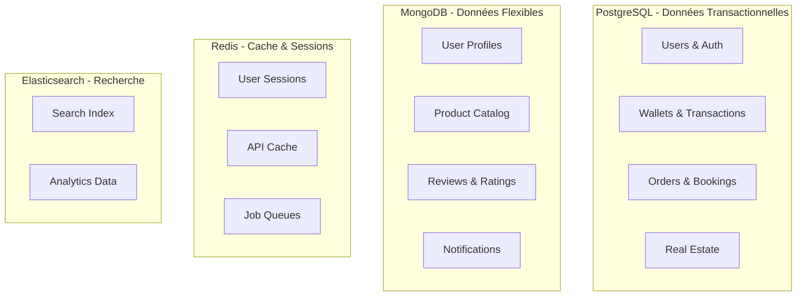

# Schéma de Base de Données - Plateforme ISMAIL

## 1. ARCHITECTURE DE DONNÉES

### 1.1 Stratégie Multi-Base



### 1.2 Principes de Conception

#### Normalisation et Performance
- **PostgreSQL** : Données relationnelles critiques (ACID)
- **MongoDB** : Documents flexibles et dénormalisés
- **Redis** : Cache haute performance et sessions
- **Elasticsearch** : Recherche full-text et analytics

#### Stratégie de Partitioning
```sql
-- Partitioning par date pour les transactions
CREATE TABLE transactions (
    id UUID NOT NULL,
    created_at TIMESTAMP NOT NULL,
    -- autres colonnes
) PARTITION BY RANGE (created_at);

-- Partitions mensuelles
CREATE TABLE transactions_2024_01 PARTITION OF transactions
    FOR VALUES FROM ('2024-01-01') TO ('2024-02-01');
```

## 2. SCHÉMA POSTGRESQL

### 2.1 Tables Core - Authentification et Utilisateurs

```sql
-- Extension pour UUID et géolocalisation
CREATE EXTENSION IF NOT EXISTS "uuid-ossp";
CREATE EXTENSION IF NOT EXISTS "postgis";

-- Table utilisateurs principale
CREATE TABLE users (
    id UUID PRIMARY KEY DEFAULT uuid_generate_v4(),
    ismail_id VARCHAR(16) UNIQUE NOT NULL,
    email VARCHAR(255) UNIQUE NOT NULL,
    phone VARCHAR(20) UNIQUE NOT NULL,
    password_hash VARCHAR(255) NOT NULL,
    first_name VARCHAR(100) NOT NULL,
    last_name VARCHAR(100) NOT NULL,
    date_of_birth DATE,
    gender VARCHAR(10),
    profile_type VARCHAR(20) NOT NULL CHECK (profile_type IN ('CLIENT', 'PARTNER', 'COMMERCIAL', 'ADMIN')),
    status VARCHAR(20) DEFAULT 'PENDING' CHECK (status IN ('PENDING', 'ACTIVE', 'SUSPENDED', 'BLOCKED')),
    kyc_status VARCHAR(20) DEFAULT 'PENDING' CHECK (kyc_status IN ('PENDING', 'VERIFIED', 'REJECTED')),
    kyc_verified_at TIMESTAMP,
    last_login_at TIMESTAMP,
    created_at TIMESTAMP DEFAULT NOW(),
    updated_at TIMESTAMP DEFAULT NOW()
);

-- Index pour performance
CREATE INDEX idx_users_ismail_id ON users(ismail_id);
CREATE INDEX idx_users_email ON users(email);
CREATE INDEX idx_users_phone ON users(phone);
CREATE INDEX idx_users_status ON users(status);

-- Table données biométriques (chiffrées)
CREATE TABLE user_biometrics (
    id UUID PRIMARY KEY DEFAULT uuid_generate_v4(),
    user_id UUID REFERENCES users(id) ON DELETE CASCADE,
    fingerprint_hash VARCHAR(512) NOT NULL,
    face_encoding TEXT NOT NULL,
    biometric_template BYTEA, -- Template chiffré
    verification_score DECIMAL(5,4),
    created_at TIMESTAMP DEFAULT NOW(),
    expires_at TIMESTAMP NOT NULL
);

-- Table cartes d'identité professionnelles
CREATE TABLE professional_cards (
    id UUID PRIMARY KEY DEFAULT uuid_generate_v4(),
    user_id UUID REFERENCES users(id) ON DELETE CASCADE,
    card_number VARCHAR(16) UNIQUE NOT NULL,
    qr_code_data TEXT NOT NULL,
    photo_url VARCHAR(500),
    issued_at TIMESTAMP DEFAULT NOW(),
    expires_at TIMESTAMP NOT NULL,
    status VARCHAR(20) DEFAULT 'ACTIVE' CHECK (status IN ('ACTIVE', 'EXPIRED', 'REVOKED')),
    created_at TIMESTAMP DEFAULT NOW()
);
```

### 2.2 Tables Portefeuille et Transactions

```sql
-- Table portefeuilles
CREATE TABLE wallets (
    id UUID PRIMARY KEY DEFAULT uuid_generate_v4(),
    user_id UUID REFERENCES users(id) ON DELETE CASCADE,
    balance DECIMAL(15,2) DEFAULT 0.00 CHECK (balance >= 0),
    currency VARCHAR(3) DEFAULT 'XOF',
    status VARCHAR(20) DEFAULT 'ACTIVE' CHECK (status IN ('ACTIVE', 'FROZEN', 'CLOSED')),
    daily_limit DECIMAL(15,2) DEFAULT 1000000.00,
    monthly_limit DECIMAL(15,2) DEFAULT 10000000.00,
    created_at TIMESTAMP DEFAULT NOW(),
    updated_at TIMESTAMP DEFAULT NOW()
);

-- Table transactions avec partitioning
CREATE TABLE transactions (
    id UUID NOT NULL DEFAULT uuid_generate_v4(),
    wallet_id UUID NOT NULL,
    transaction_type VARCHAR(20) NOT NULL CHECK (transaction_type IN ('CREDIT', 'DEBIT', 'TRANSFER', 'COMMISSION', 'CASHBACK')),
    amount DECIMAL(15,2) NOT NULL CHECK (amount > 0),
    balance_before DECIMAL(15,2) NOT NULL,
    balance_after DECIMAL(15,2) NOT NULL,
    description TEXT,
    reference VARCHAR(100),
    external_reference VARCHAR(100),
    metadata JSONB,
    status VARCHAR(20) DEFAULT 'PENDING' CHECK (status IN ('PENDING', 'COMPLETED', 'FAILED', 'CANCELLED')),
    processed_at TIMESTAMP,
    created_at TIMESTAMP NOT NULL DEFAULT NOW(),
    
    PRIMARY KEY (id, created_at)
) PARTITION BY RANGE (created_at);

-- Contrainte de cohérence pour les soldes
ALTER TABLE transactions ADD CONSTRAINT check_balance_consistency 
    CHECK (
        (transaction_type = 'CREDIT' AND balance_after = balance_before + amount) OR
        (transaction_type = 'DEBIT' AND balance_after = balance_before - amount)
    );

-- Index pour performance
CREATE INDEX idx_transactions_wallet_id ON transactions(wallet_id);
CREATE INDEX idx_transactions_type ON transactions(transaction_type);
CREATE INDEX idx_transactions_status ON transactions(status);
```

### 2.3 Tables Modules Métier

```sql
-- Table prestataires de services
CREATE TABLE service_providers (
    id UUID PRIMARY KEY DEFAULT uuid_generate_v4(),
    user_id UUID REFERENCES users(id) ON DELETE CASCADE,
    business_name VARCHAR(255) NOT NULL,
    business_type VARCHAR(100) NOT NULL,
    category VARCHAR(100) NOT NULL,
    subcategory VARCHAR(100),
    description TEXT,
    location GEOMETRY(POINT, 4326) NOT NULL,
    service_radius INTEGER DEFAULT 10, -- km
    hourly_rate DECIMAL(10,2),
    minimum_charge DECIMAL(10,2),
    rating DECIMAL(3,2) DEFAULT 0.00 CHECK (rating >= 0 AND rating <= 5),
    total_reviews INTEGER DEFAULT 0,
    total_jobs INTEGER DEFAULT 0,
    is_verified BOOLEAN DEFAULT false,
    is_active BOOLEAN DEFAULT true,
    availability_schedule JSONB, -- Horaires de disponibilité
    created_at TIMESTAMP DEFAULT NOW(),
    updated_at TIMESTAMP DEFAULT NOW()
);

-- Index spatial pour géolocalisation
CREATE INDEX idx_providers_location ON service_providers USING GIST(location);
CREATE INDEX idx_providers_category ON service_providers(category);
CREATE INDEX idx_providers_rating ON service_providers(rating);

-- Table réservations de services
CREATE TABLE service_bookings (
    id UUID PRIMARY KEY DEFAULT uuid_generate_v4(),
    provider_id UUID REFERENCES service_providers(id),
    client_id UUID REFERENCES users(id),
    service_type VARCHAR(100) NOT NULL,
    description TEXT NOT NULL,
    scheduled_at TIMESTAMP NOT NULL,
    estimated_duration INTEGER, -- minutes
    estimated_cost DECIMAL(10,2),
    actual_cost DECIMAL(10,2),
    location GEOMETRY(POINT, 4326),
    address TEXT,
    status VARCHAR(20) DEFAULT 'PENDING' CHECK (status IN ('PENDING', 'CONFIRMED', 'IN_PROGRESS', 'COMPLETED', 'CANCELLED')),
    cancellation_reason TEXT,
    completed_at TIMESTAMP,
    created_at TIMESTAMP DEFAULT NOW(),
    updated_at TIMESTAMP DEFAULT NOW()
);

-- Table commandes e-commerce
CREATE TABLE shop_orders (
    id UUID PRIMARY KEY DEFAULT uuid_generate_v4(),
    order_number VARCHAR(20) UNIQUE NOT NULL,
    customer_id UUID REFERENCES users(id),
    merchant_id UUID REFERENCES users(id),
    subtotal DECIMAL(12,2) NOT NULL,
    tax_amount DECIMAL(12,2) DEFAULT 0.00,
    shipping_cost DECIMAL(12,2) DEFAULT 0.00,
    total_amount DECIMAL(12,2) NOT NULL,
    currency VARCHAR(3) DEFAULT 'XOF',
    status VARCHAR(20) DEFAULT 'PENDING' CHECK (status IN ('PENDING', 'CONFIRMED', 'PROCESSING', 'SHIPPED', 'DELIVERED', 'CANCELLED')),
    payment_status VARCHAR(20) DEFAULT 'PENDING' CHECK (payment_status IN ('PENDING', 'PAID', 'FAILED', 'REFUNDED')),
    shipping_address JSONB NOT NULL,
    billing_address JSONB,
    tracking_number VARCHAR(100),
    shipped_at TIMESTAMP,
    delivered_at TIMESTAMP,
    created_at TIMESTAMP DEFAULT NOW(),
    updated_at TIMESTAMP DEFAULT NOW()
);

-- Table articles de commande
CREATE TABLE order_items (
    id UUID PRIMARY KEY DEFAULT uuid_generate_v4(),
    order_id UUID REFERENCES shop_orders(id) ON DELETE CASCADE,
    product_id UUID NOT NULL, -- Référence vers MongoDB
    product_name VARCHAR(255) NOT NULL,
    product_sku VARCHAR(100),
    quantity INTEGER NOT NULL CHECK (quantity > 0),
    unit_price DECIMAL(10,2) NOT NULL,
    total_price DECIMAL(10,2) NOT NULL,
    product_options JSONB, -- Variantes, options
    created_at TIMESTAMP DEFAULT NOW()
);

-- Table réservations hôtelières
CREATE TABLE hotel_bookings (
    id UUID PRIMARY KEY DEFAULT uuid_generate_v4(),
    booking_reference VARCHAR(20) UNIQUE NOT NULL,
    guest_id UUID REFERENCES users(id),
    hotel_id UUID NOT NULL, -- Référence vers MongoDB
    room_type VARCHAR(100) NOT NULL,
    check_in_date DATE NOT NULL,
    check_out_date DATE NOT NULL,
    nights INTEGER NOT NULL CHECK (nights > 0),
    guests_count INTEGER NOT NULL CHECK (guests_count > 0),
    room_rate DECIMAL(10,2) NOT NULL,
    total_amount DECIMAL(12,2) NOT NULL,
    status VARCHAR(20) DEFAULT 'PENDING' CHECK (status IN ('PENDING', 'CONFIRMED', 'CHECKED_IN', 'CHECKED_OUT', 'CANCELLED', 'NO_SHOW')),
    special_requests TEXT,
    cancellation_policy JSONB,
    confirmed_at TIMESTAMP,
    checked_in_at TIMESTAMP,
    checked_out_at TIMESTAMP,
    created_at TIMESTAMP DEFAULT NOW(),
    updated_at TIMESTAMP DEFAULT NOW()
);

-- Table biens immobiliers
CREATE TABLE real_estate_properties (
    id UUID PRIMARY KEY DEFAULT uuid_generate_v4(),
    owner_id UUID REFERENCES users(id),
    agent_id UUID REFERENCES users(id),
    property_type VARCHAR(50) NOT NULL CHECK (property_type IN ('APARTMENT', 'HOUSE', 'OFFICE', 'LAND', 'COMMERCIAL')),
    transaction_type VARCHAR(20) NOT NULL CHECK (transaction_type IN ('SALE', 'RENT', 'SEASONAL')),
    title VARCHAR(255) NOT NULL,
    description TEXT,
    location GEOMETRY(POINT, 4326) NOT NULL,
    address TEXT NOT NULL,
    city VARCHAR(100) NOT NULL,
    district VARCHAR(100),
    surface_area DECIMAL(8,2), -- m²
    land_area DECIMAL(10,2), -- m²
    rooms_count INTEGER,
    bedrooms_count INTEGER,
    bathrooms_count INTEGER,
    price DECIMAL(15,2) NOT NULL,
    price_per_sqm DECIMAL(10,2),
    charges DECIMAL(10,2) DEFAULT 0.00,
    deposit DECIMAL(15,2),
    is_furnished BOOLEAN DEFAULT false,
    amenities JSONB, -- Équipements
    status VARCHAR(20) DEFAULT 'AVAILABLE' CHECK (status IN ('AVAILABLE', 'RESERVED', 'RENTED', 'SOLD', 'INACTIVE')),
    views_count INTEGER DEFAULT 0,
    created_at TIMESTAMP DEFAULT NOW(),
    updated_at TIMESTAMP DEFAULT NOW()
);

-- Index géospatial pour l'immobilier
CREATE INDEX idx_properties_location ON real_estate_properties USING GIST(location);
CREATE INDEX idx_properties_type ON real_estate_properties(property_type, transaction_type);
CREATE INDEX idx_properties_price ON real_estate_properties(price);

-- Table dossiers de recouvrement
CREATE TABLE recovery_cases (
    id UUID PRIMARY KEY DEFAULT uuid_generate_v4(),
    case_number VARCHAR(20) UNIQUE NOT NULL,
    creditor_id UUID REFERENCES users(id),
    debtor_id UUID REFERENCES users(id),
    case_type VARCHAR(20) NOT NULL CHECK (case_type IN ('RENT', 'COMMERCIAL', 'SERVICE', 'OTHER')),
    original_amount DECIMAL(15,2) NOT NULL,
    outstanding_amount DECIMAL(15,2) NOT NULL,
    interest_rate DECIMAL(5,4) DEFAULT 0.0000,
    penalty_rate DECIMAL(5,4) DEFAULT 0.0000,
    due_date DATE NOT NULL,
    description TEXT,
    status VARCHAR(20) DEFAULT 'ACTIVE' CHECK (status IN ('ACTIVE', 'PARTIAL', 'RESOLVED', 'WRITTEN_OFF', 'LEGAL')),
    priority VARCHAR(10) DEFAULT 'MEDIUM' CHECK (priority IN ('LOW', 'MEDIUM', 'HIGH', 'URGENT')),
    assigned_agent_id UUID REFERENCES users(id),
    last_contact_date DATE,
    next_action_date DATE,
    resolution_date DATE,
    created_at TIMESTAMP DEFAULT NOW(),
    updated_at TIMESTAMP DEFAULT NOW()
);

-- Table actions de recouvrement
CREATE TABLE recovery_actions (
    id UUID PRIMARY KEY DEFAULT uuid_generate_v4(),
    case_id UUID REFERENCES recovery_cases(id) ON DELETE CASCADE,
    action_type VARCHAR(20) NOT NULL CHECK (action_type IN ('SMS', 'EMAIL', 'CALL', 'LETTER', 'VISIT', 'LEGAL')),
    description TEXT NOT NULL,
    scheduled_at TIMESTAMP,
    executed_at TIMESTAMP,
    result VARCHAR(20) CHECK (result IN ('SUCCESS', 'FAILED', 'PARTIAL', 'NO_RESPONSE')),
    notes TEXT,
    cost DECIMAL(10,2) DEFAULT 0.00,
    created_by UUID REFERENCES users(id),
    created_at TIMESTAMP DEFAULT NOW()
);
```

## 3. SCHÉMA MONGODB

### 3.1 Collections Principales

```javascript
// Collection profils utilisateurs étendus
db.user_profiles.createIndex({ "userId": 1 }, { unique: true });
db.user_profiles.createIndex({ "location": "2dsphere" });

// Structure document profil
{
  "_id": ObjectId(),
  "userId": "uuid-reference",
  "avatar": {
    "url": "string",
    "thumbnailUrl": "string"
  },
  "bio": "string",
  "location": {
    "type": "Point",
    "coordinates": [longitude, latitude]
  },
  "address": {
    "street": "string",
    "city": "string",
    "district": "string",
    "postalCode": "string",
    "country": "string"
  },
  "preferences": {
    "language": "fr",
    "currency": "XOF",
    "notifications": {
      "email": true,
      "sms": true,
      "push": true
    },
    "privacy": {
      "showLocation": true,
      "showPhone": false
    }
  },
  "socialLinks": {
    "facebook": "string",
    "linkedin": "string",
    "website": "string"
  },
  "documents": [
    {
      "type": "ID_CARD",
      "url": "string",
      "verificationStatus": "VERIFIED",
      "uploadedAt": ISODate(),
      "expiresAt": ISODate()
    }
  ],
  "createdAt": ISODate(),
  "updatedAt": ISODate()
}

// Collection catalogue produits
db.products.createIndex({ "merchantId": 1 });
db.products.createIndex({ "category": 1, "subcategory": 1 });
db.products.createIndex({ "name": "text", "description": "text" });
db.products.createIndex({ "price": 1 });
db.products.createIndex({ "rating": -1 });

// Structure document produit
{
  "_id": ObjectId(),
  "merchantId": "uuid-reference",
  "sku": "string",
  "name": "string",
  "description": "string",
  "category": "string",
  "subcategory": "string",
  "brand": "string",
  "price": NumberDecimal("99.99"),
  "compareAtPrice": NumberDecimal("129.99"),
  "currency": "XOF",
  "stock": {
    "quantity": 100,
    "lowStockThreshold": 10,
    "trackQuantity": true
  },
  "variants": [
    {
      "id": "variant-1",
      "name": "Taille L",
      "price": NumberDecimal("99.99"),
      "stock": 25,
      "sku": "PROD-L"
    }
  ],
  "images": [
    {
      "url": "string",
      "alt": "string",
      "position": 1
    }
  ],
  "specifications": {
    "weight": "1.5kg",
    "dimensions": "30x20x10cm",
    "material": "Cotton"
  },
  "seo": {
    "title": "string",
    "description": "string",
    "keywords": ["tag1", "tag2"]
  },
  "rating": {
    "average": 4.5,
    "count": 127
  },
  "status": "ACTIVE", // ACTIVE, INACTIVE, DRAFT
  "isDigital": false,
  "shippingRequired": true,
  "tags": ["new", "featured"],
  "createdAt": ISODate(),
  "updatedAt": ISODate()
}
```

### 3.2 Collections Secondaires

```javascript
// Collection avis et évaluations
db.reviews.createIndex({ "targetId": 1, "targetType": 1 });
db.reviews.createIndex({ "authorId": 1 });
db.reviews.createIndex({ "rating": -1 });

{
  "_id": ObjectId(),
  "authorId": "uuid-reference",
  "targetId": "uuid-reference", // ID du produit/service/prestataire
  "targetType": "PRODUCT", // PRODUCT, SERVICE, PROVIDER, HOTEL
  "rating": 5,
  "title": "Excellent produit",
  "comment": "string",
  "images": ["url1", "url2"],
  "isVerifiedPurchase": true,
  "helpfulVotes": 12,
  "reportedCount": 0,
  "status": "PUBLISHED", // PUBLISHED, PENDING, REJECTED
  "moderatedBy": "uuid-reference",
  "createdAt": ISODate(),
  "updatedAt": ISODate()
}

// Collection notifications
db.notifications.createIndex({ "userId": 1, "createdAt": -1 });
db.notifications.createIndex({ "status": 1 });

{
  "_id": ObjectId(),
  "userId": "uuid-reference",
  "type": "ORDER_CONFIRMED", // Type de notification
  "title": "Commande confirmée",
  "message": "Votre commande #12345 a été confirmée",
  "data": {
    "orderId": "uuid-reference",
    "amount": "150.00"
  },
  "channels": ["PUSH", "EMAIL"],
  "status": "SENT", // PENDING, SENT, DELIVERED, READ
  "priority": "NORMAL", // LOW, NORMAL, HIGH, URGENT
  "scheduledAt": ISODate(),
  "sentAt": ISODate(),
  "readAt": ISODate(),
  "createdAt": ISODate()
}
```

## 4. STRATÉGIE DE CACHE REDIS

### 4.1 Structure des Clés

```redis
# Sessions utilisateur
user:session:{user_id} -> JSON session data (TTL: 24h)

# Cache API
api:cache:{endpoint}:{params_hash} -> JSON response (TTL: 5min)

# Données fréquemment accédées
user:profile:{user_id} -> JSON profile (TTL: 1h)
wallet:balance:{wallet_id} -> balance amount (TTL: 5min)

# Compteurs et métriques
stats:daily:transactions:{date} -> count
stats:user:login:{user_id} -> timestamp

# Queues de traitement
queue:notifications -> List of notification jobs
queue:emails -> List of email jobs
queue:sms -> List of SMS jobs

# Rate limiting
rate_limit:api:{user_id}:{endpoint} -> request count (TTL: 1h)
rate_limit:login:{ip} -> attempt count (TTL: 15min)

# Cache géospatial
geo:providers:{category} -> Geospatial index of providers
```

### 4.2 Patterns de Cache

```python
# Pattern Cache-Aside
def get_user_profile(user_id):
    # Tentative de récupération depuis le cache
    cached = redis.get(f"user:profile:{user_id}")
    if cached:
        return json.loads(cached)
    
    # Si pas en cache, récupération depuis la DB
    profile = db.user_profiles.find_one({"userId": user_id})
    if profile:
        # Mise en cache pour 1 heure
        redis.setex(f"user:profile:{user_id}", 3600, json.dumps(profile))
    
    return profile

# Pattern Write-Through pour le portefeuille
def update_wallet_balance(wallet_id, new_balance):
    # Mise à jour en base
    db.wallets.update_one(
        {"id": wallet_id},
        {"$set": {"balance": new_balance, "updatedAt": datetime.now()}}
    )
    
    # Mise à jour du cache
    redis.setex(f"wallet:balance:{wallet_id}", 300, str(new_balance))
```

## PROCHAINES ÉTAPES

1. **Validation schéma** : Review avec équipe backend
2. **Migration scripts** : Création des scripts de migration
3. **Seed data** : Données de test et développement
4. **Performance testing** : Tests de charge sur les requêtes

---

**Statut** : ✅ Schéma de base défini
**Validation** : En attente équipe backend
**Prochaine étape** : Scripts de migration
